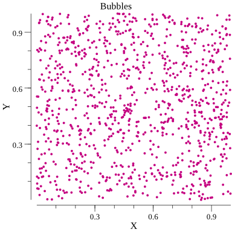
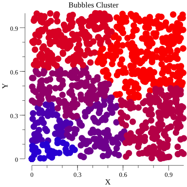
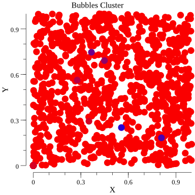
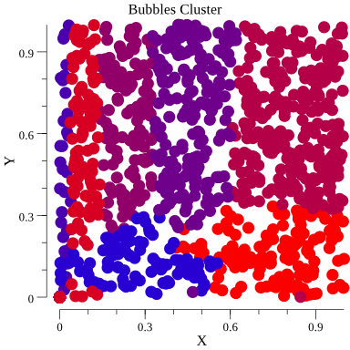
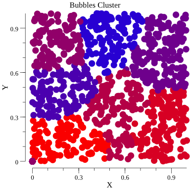
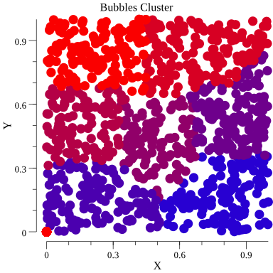
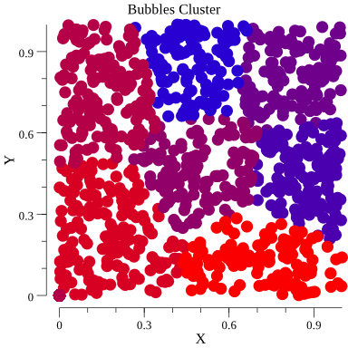
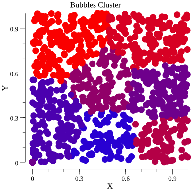

# Test for data clustering using kmean

Clustering with various distance functions:

# need also to try Self Organizing Maps (SOM) 
https://github.com/tadvi/ann
https://github.com/milosgajdos83/gosom

http://www.fodop.com/ar-1002
